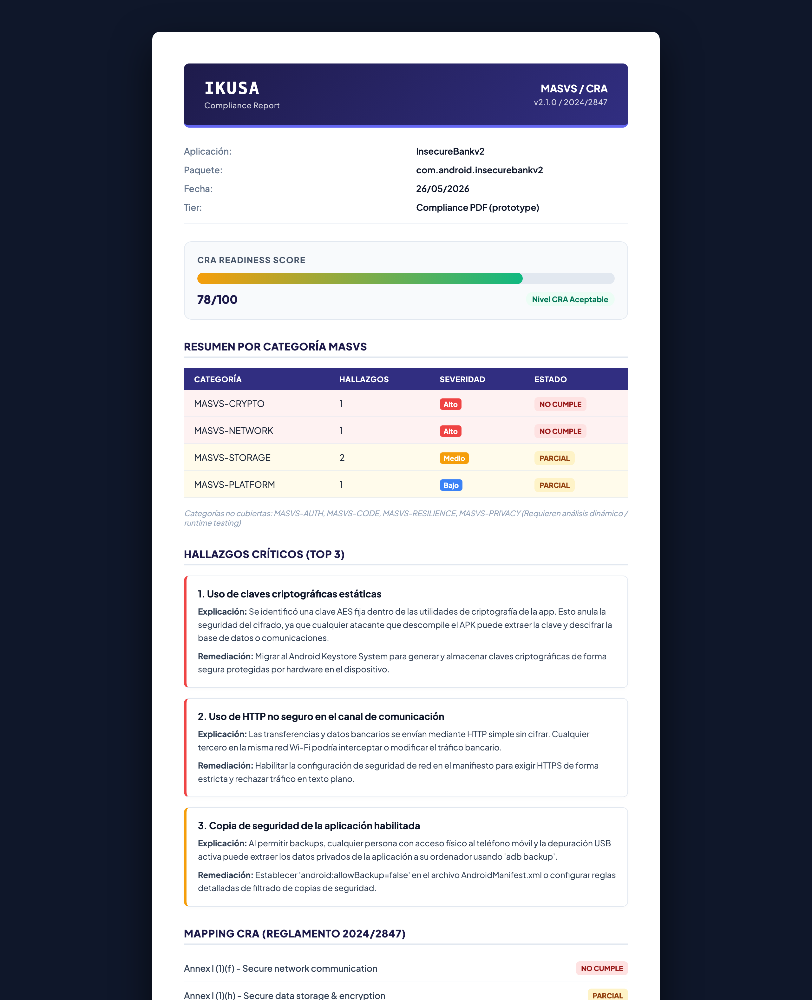
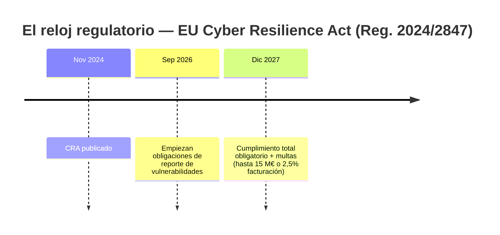
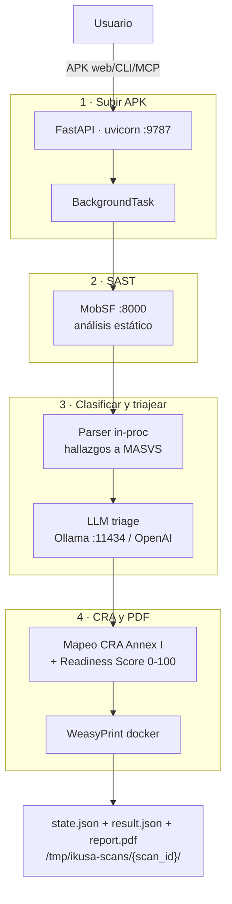
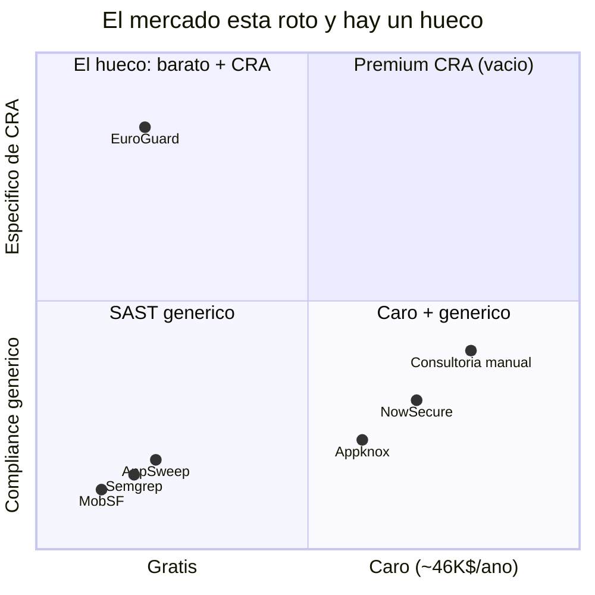
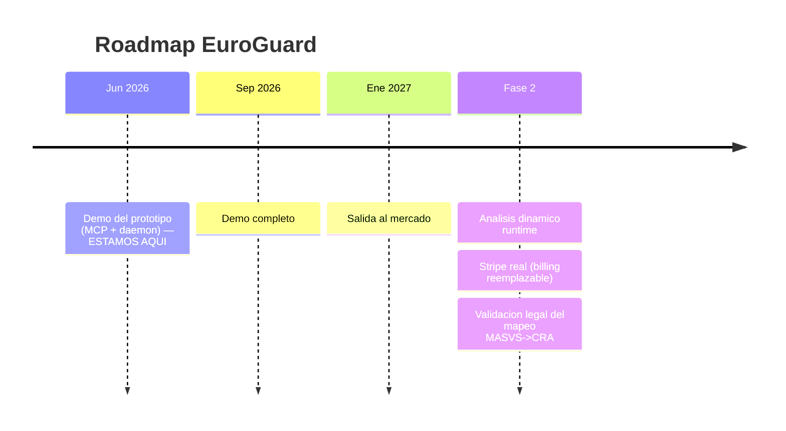

# EuroGuard — Compliance Scanner

> **More Apps, More AI, More Vulnerabilities.**
> De un APK Android a evidencia de cumplimiento del **EU Cyber Resilience Act** en minutos.

[](https://github.com/hongda-zhu/PAE/actions/workflows/test.yml)
[](LICENSE)
[](https://github.com/hongda-zhu/PAE/actions/workflows/test.yml)
[](pyproject.toml)
[](https://eur-lex.europa.eu/eli/reg/2024/2847/oj)

> <sub>**Nota de marca:** *EuroGuard* es la marca del producto (equipo PAE · UPC 2026); *IKUSA* (戦, "batalla") es el nombre interno del prototipo en el código **y** el de la empresa de ciberseguridad móvil de Barcelona que mentoriza el proyecto — por eso los comandos, la CLI y la UI conservan `IKUSA`. No hemos renombrado el código.</sub>

---

## 🎯 Qué es

EuroGuard coge un **APK Android** y, en minutos, produce **evidencia de cumplimiento del EU Cyber Resilience Act**: un análisis estático (SAST) clasificado en categorías **OWASP MASVS**, donde un **LLM** triajea y explica cada hallazgo en lenguaje llano y lo mapea al **artículo legal del CRA** que implica. El resultado es un **CRA Readiness Score (0–100)** y un informe PDF entregable.

La inferencia es **LOCAL por defecto** (Ollama, on-prem): **el APK nunca sale de tu máquina**. Opcionalmente puedes acelerar el triaje con OpenAI a cambio de enviar los datos a un tercero.



<sub>Informe de ejemplo para la app vulnerable de referencia **InsecureBankv2**. El encabezado dice *"IKUSA Compliance Report"* (codename del prototipo, ver nota de marca). El **78/100** mostrado es **ILUSTRATIVO**, hecho a mano para revisar el layout — ver [Metodología](#-metodología).</sub>

---

## ▶ Pruébalo en 60 segundos (sin instalar nada)

- 🌐 **Demo en el navegador:** [`demostracion_interactiva.html`](demostracion_interactiva.html) — recreación 100% cliente-side, sin servidor. Arrastra un APK de prueba, pulsa "Analizar" y recorre pipeline → resultados → historial.
- 🎥 **Vídeo (~1–2 min):** [`videos/ikusa_demo.webm`](videos/ikusa_demo.webm) — *nota:* GitHub no reproduce `.webm` inline; descárgalo para verlo.
- 📄 **Informe de ejemplo:** [`reporte_ejemplo_compliance.html`](reporte_ejemplo_compliance.html) — el PDF/HTML final que recibe el cliente.

**¿Quieres el stack real?** → `make demo` (sólo necesitas Docker). Ver **[SETUP.md](SETUP.md)**.

---

## 😖 El problema — y por qué AHORA

El desarrollo asistido por IA y el *vibe coding* han disparado el volumen de apps... y de vulnerabilidades. **Más apps, más IA, más vulnerabilidades.**

- **53%** de los equipos encontraron problemas de seguridad **post-release** en 2025. *(Veracode 2025)*
- **2,74×** más vulnerabilidades en código generado por IA frente a código humano. *(2024)*
- El volumen de apps publicadas se dispara **2022–2030** empujado por el desarrollo asistido por IA. *(AppBrain 2026; Samsung/Verizon MSI 2025)*

El testing existe, pero llega tarde y no habla el idioma del cumplimiento. El resultado: equipos que descubren el problema cuando ya está en producción — y ahora, además, con un reloj regulatorio en marcha.

---

## ⏰ El reloj regulatorio — el EU Cyber Resilience Act (Reg. 2024/2847)

El CRA convierte la ciberseguridad de "buena práctica" en **obligación legal con multas** para todo producto con elementos digitales que entre al mercado UE.



**Obligaciones clave:**
- Evaluación de ciberseguridad **antes** de entrar al mercado UE.
- Gestión del ciclo de vida: **parches y actualizaciones gratis hasta 5 años**.
- **Regla de las 24h:** notificar a ENISA una vulnerabilidad explotada o incidente grave en **≤ 24 horas**.

**Sanciones:** hasta **15 M€ o el 2,5% de la facturación global anual** (la mayor) **+ retirada inmediata** del producto del mercado UE. *(Fuente: EU Commission 2024.)*

---

## ⚙️ Cómo funciona

1. **Subes un APK** (web, CLI o vía MCP).
2. **MobSF** hace el análisis estático (SAST).
3. Un **parser** clasifica los hallazgos en categorías **OWASP MASVS**, y un **LLM** (Qwen2.5-7B local u OpenAI) los **triajea y explica** en lenguaje llano.
4. EuroGuard **mapea cada categoría al artículo del CRA Annex I** que implica y calcula el **CRA Readiness Score 0–100**, exportado a **PDF**.



<sub>El estado son ficheros JSON/PDF planos bajo `SCAN_STORAGE`; no hay base de datos.</sub>

---

## 🌉 Qué lo hace distinto (el puente MASVS→CRA)

Un scanner habla con el **desarrollador**. EuroGuard habla con el **responsable de cumplimiento**.

| | Un scanner SAST dice... | EuroGuard dice... |
|---|---|---|
| **A quién** | al DEV | al responsable de CUMPLIMIENTO |
| **Qué** | `MASVS-NETWORK: tráfico HTTP en claro` | **Annex I — comunicación de red segura → NO CUMPLE** |
| **Y además** | (nada) | remediación en lenguaje llano + impacto legal |

> *"Lo importante es el informe, no el scan."* — mentor del proyecto.

El **moat** no es el motor de scan: MobSF/Semgrep son el motor que **orquestamos**, no el competidor. El valor está en el **mapeo curado a mano** en [`data/masvs_to_cra.yaml`](data/masvs_to_cra.yaml), que conecta cada categoría MASVS con los artículos del CRA Annex I.

---

## 🕳️ El mercado está roto — y hay un hueco

Matriz competitiva: **Precio** (gratis → ~46K$/año) × **Compliance** (genérico → específico de CRA).



<sub>EuroGuard ocupa el cuadrante vacío: precio bajo + compliance específico de CRA, donde hoy no hay competidores.</sub>

El cuadrante **barato + CRA-específico está VACÍO**. Ahí entra EuroGuard. *(Fuente de rangos de precio: Vendr 2025.)*

---

## 👥 Validado con profesionales reales

**10 entrevistas** a devs/PMs de Smadex, Promofarma, TitanOS, Flanks, Factorial, BSC, NTT Data, SDG Group, Meestra AI y Zernio.

- **10/10** pagarían por cumplimiento automatizado.
- **8/10** hacen testing pero lo consideran **insuficiente**.
- **7/10** quieren integración directa en su workflow.
- **6/10** frustrados con falsos positivos y falta de priorización.

**Clientes objetivo:**
- **Startups / PYMEs** — sin equipo ni presupuesto de seguridad.
- **Equipos DevOps** — auditan la app principal; el resto del portfolio queda expuesto.
- **Freelance / consultoría** — el cliente quiere compliance y no pagará un auditor.

---

## 🔋 Cómputo, coste y privacidad

El modelo local es el **default deliberado**: para una PYME, la **soberanía del dato** y el **coste marginal ~0** pesan más que 3 minutos de espera.

| Proveedor | Latencia/scan | Dónde corre | Coste marginal | Datos del APK |
|---|---|---|---|---|
| **Ollama Qwen2.5-7B** *(local, DEFAULT)* | ~3 min CPU (segundos en GPU) | on-prem, 0 llamadas externas | ~0€ (sólo electricidad) | **nunca salen de tu máquina** |
| OpenAI `gpt-4o-mini` | ~10 s | cloud | céntimos/scan | APK/hallazgos salen a un tercero |

---

## 🔬 Alcance del prototipo y limitaciones

Sección honesta — imprescindible para entender qué es y qué no es esto hoy.

**✅ REAL (funciona end-to-end):**
- Pipeline completo **MobSF → parser → LLM → CRA → PDF**.
- **3 superficies:** Web, CLI, MCP.
- **96 tests**, Dockerizado, corre **100% local**.

**⚠️ MOCK / LIMITADO (con honestidad):**
- **Pagos = stub con forma de Stripe** ([`billing.py`](src/ikusa/billing.py)) — sin dinero real.
- **Sin base de datos:** el estado son ficheros JSON/PDF bajo `SCAN_STORAGE`.
- Hoy el pipeline triajea y puntúa **3 de las 8 categorías MASVS** — `STORAGE`, `CRYPTO`, `NETWORK` (ver `TARGET_CATEGORIES` en [`parser.py`](src/ikusa/parser.py)). Las demás (`AUTH`, `CODE`, `RESILIENCE`, `PRIVACY`…) requieren **análisis dinámico/runtime** y se reportan como **NO CUBIERTAS** — el propio informe lo declara.
- El parser puede **aflorar de forma oportunista** categorías secundarias (p. ej. `PLATFORM`) cuando aparecen en el scan, pero **sólo `STORAGE`/`CRYPTO`/`NETWORK` entran en el triaje, el scoring y la cobertura** — por eso el informe de ejemplo muestra una fila `PLATFORM` aunque no cuente para la puntuación.
- El mapeo MASVS→CRA es **best-effort y NO es una certificación legal**. El informe lleva el disclaimer: *"No sustituye una auditoría formal."*

---

## 📐 Metodología

**(a) Clasificación** ([`parser.py`](src/ikusa/parser.py)): cada hallazgo se mapea de `appsec.section` → MASVS; si falla, *fallback* por keyword; lo que no se puede clasificar se **descarta** (nunca se asigna una categoría "por defecto"). El parser puede etiquetar categorías secundarias (p. ej. `PLATFORM`) cuando el scan las expone, pero sólo `STORAGE`/`CRYPTO`/`NETWORK` cuentan para el triaje y la cobertura.

**(b) Mapeo MASVS→CRA** ([`data/masvs_to_cra.yaml`](data/masvs_to_cra.yaml)): *lookup* conservador escrito a mano. Fuentes: **OWASP MASVS v2.1.0** y **CRA Reg. 2024/2847 Annex I**. Política: *"ante la duda, omitir antes que sobre-afirmar."*

**(c) Scoring** ([`score.py`](src/ikusa/score.py)):

```
base  = 100 − 12·HIGH − 5·MEDIO − 2·BAJO        (recortado a [0,100])
final = base · (0.5 + 0.5 · cobertura)          cobertura = categorías_cubiertas / 8
```

> **Por qué un scan limpio no da 100.** Con la cobertura actual de 3 categorías, `cobertura = 3/8 = 0,375`, así que un APK sin hallazgos **topa en ≈ 69/100** — **por diseño**: una cobertura parcial no puede atestar cumplimiento total. *(El 78/100 del informe de ejemplo es ilustrativo, hecho a mano para revisar el layout.)*

---

## 🗺️ Roadmap



**Fase 2:** análisis dinámico/runtime para el resto de categorías MASVS · **Stripe real** (el billing ya es un stub reemplazable) · validación del mapeo con un experto legal.

---

## 💼 Modelo de negocio

| Producto | Precio | Para quién |
|---|---|---|
| **Análisis web** | **5 € pago único** | Informe PDF como evidencia CRA; pruebas puntuales y validación inicial. |
| **Suscripción Terminal** | **49 €/mes** | Escaneos desde terminal o en cada actualización; equipos que mantienen apps. |

Coste marginal **~0** (local) frente a una auditoría manual de **miles de € y semanas**.

<sub>Cifras reales en [`billing.py`](src/ikusa/billing.py): `web-scan` = 500 céntimos, `terminal-sub` = 4900 céntimos.</sub>

---

## 🚀 Ejecútalo localmente

Sólo necesitas **Docker**:

```bash
make demo
```

Levanta el stack (MobSF + Ollama + app) y deja la app en **http://localhost:9787**. La primera vez tarda ~5–10 min (descarga del modelo LLM).

Detalle completo — env vars, primer setup, *troubleshooting*, *teardown* → **[SETUP.md](SETUP.md)**.
Guía para evaluadores → **[LEEME_EVALUADORES.md](LEEME_EVALUADORES.md)**.

---

## 🧩 Tres superficies

- **🌐 Web** — rápido, sin instalar nada; arrastra el APK y descarga el PDF.
- **⌨️ CLI** — `ikusa-cli scan app.apk --fail-on alto` → **exit code para CI** (`0` ok, `2` por encima del umbral).
- **🔌 MCP** — servidor stdio con **4 tools** (`scan_apk`, `get_scan_status`, `get_scan_findings`, `list_scans`) para Cursor u otros asistentes IA.

---

## 🛠️ Calidad e ingeniería

- **96 tests** (unit + integración + E2E smoke).
- **GitHub Actions CI** corriendo en **Python 3.12** ([`.github/workflows/test.yml`](.github/workflows/test.yml)).
- Licencia **Apache-2.0**.

> **Reproducibilidad:** el LLM usa temperatura baja → baja varianza, pero **no es bit-reproducible**; el resto del pipeline es determinista.
> **Qué NO validan los tests:** la exactitud legal del mapeo ni el juicio del LLM. Eso queda explícitamente fuera de alcance.

---

## ✨ Cierre

> **Hacemos que cumplir no sea un freno para crear, sino una parte natural del desarrollo.**

### Autores

| Rol | Nombre |
|---|---|
| CEO | Arnau Garcia |
| CTO | Ishak Felfoul |
| CPO | Ferran Mesas |
| CISO | Hongda Zhu |

*EuroGuard · PAE · UPC 2026 — mentorizado por IKUSA (Barcelona).*

### Licencia

Apache License 2.0 — ver [LICENSE](LICENSE).